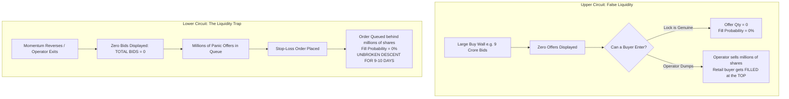
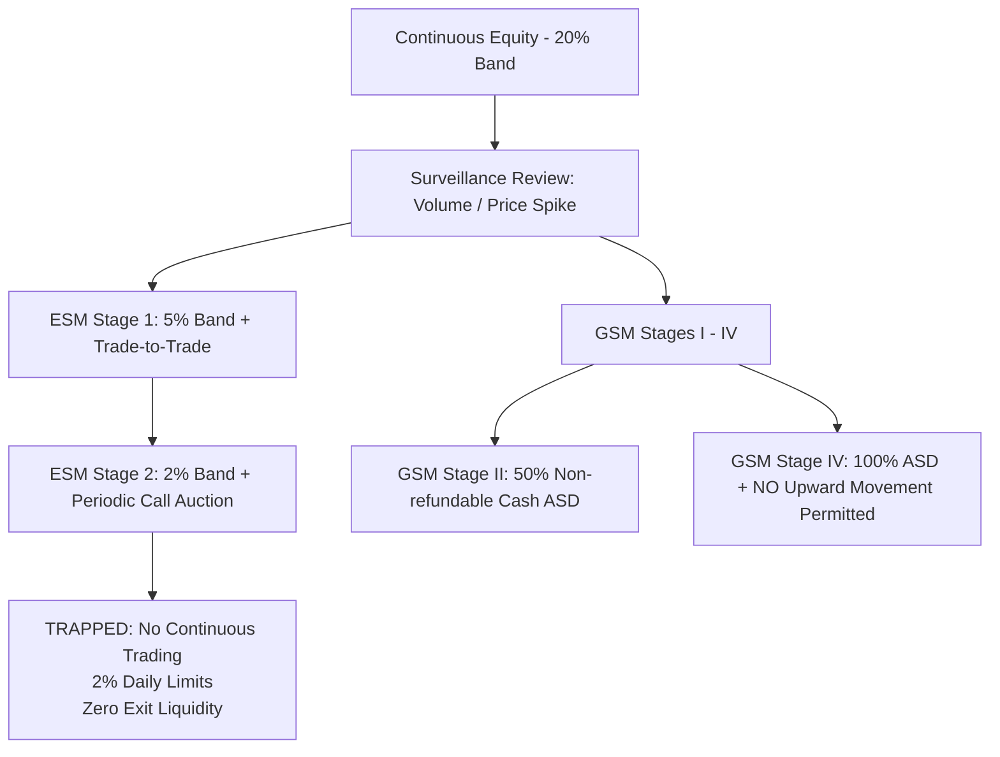

# Master Project Brief & System Architecture
## Autonomous Paper-Trading Framework for Indian Micro-Cap Circuit Equities

**Document ID:** `shared/MASTER_PROJECT_BRIEF.md`  
**Target Audience:** Claude (Analyst / Red-Team / Quantitative Modeler)  
**Co-Authors:** Antigravity (Google / Builder) & ChatGPT (OpenAI / Researcher)  
**Curator:** Yashu (Lead Trader / Orchestrator)  
**Date:** 2026-09-10  
**Version:** 2.0 (Elaborate Master Architecture Release)

---

## 1. Project Background, Origin, and Evolution

### 1.1 The Original Thesis: The +20% Monthly Circuit Dream
This project originated from a retail swing-trading strategy focused on Indian small- and micro-cap equities listed on the Bombay Stock Exchange (BSE) and National Stock Exchange (NSE). 

The initial hypothesis was simple:
* Identify securities hitting Upper Circuits (+5%, +10%, or +20% daily price caps) with massive resting buy orders.
* Enter via Pre-Market Call Auction (AMO orders at 09:00 AM) or marketable limit orders to capture momentum.
* Ride consecutive daily circuit limits to achieve an aggregate monthly gain of **+15% to +20%** (compounding four +5% daily circuit days equals $+21.55\%$).

### 1.2 The User's Real-World Experience: Two Wins and the Fatal Third Cycle
The user's trading trajectory revealed the exact structural trap inherent in Indian micro-caps:
1. **Cycles 1 & 2 (Success):** The user achieved two consecutive winning cycles producing ~20% net returns by catching early-stage momentum.
2. **Cycle 3 (The CROPSTER Disaster):** In the third cycle, the user purchased 12,560 shares of **CROPSTER (BSE: 523105)** at an average price of ₹4.77 (~₹59,900 capital outlay). 
   - On 24 August 2026, the position showed a minor loss (−₹2,763, LTP ₹4.55).
   - On 25 August 2026 at 10:28 AM, the stock abruptly crashed to the Lower Circuit at ₹4.33 (−4.84%).
   - When the user attempted to cut losses, the order book showed **0 BIDS ACROSS ALL 5 LEVELS** against 46,46,100 shares waiting on the offer side (with 28,46,239 shares offered at the lower circuit price alone).
   - **The initial perception vs. the reality:** While a frozen investor holding without an exit order would have suffered a 9-day descent to an absolute trough of **₹2.91** (−39.0%), Yashu actively submitted a sell limit order on **Day 3 (27-Aug)**. Despite the stock sitting on the Lower Circuit limit, **15,735,454 shares (1.57 Crore)** traded that morning; Yashu's 12,560 shares filled within **1 hour** at ~₹4.09, cutting the loss cleanly at **−₹8,500.00 (−14.18%)**. This empirical fact proved that morning queue draining exists and that active limit queuing prevents full −40% drawdowns.

### 1.3 The Formation of the Tri-Agent Collaborative Architecture
To eliminate emotional bias, prevent catastrophic drawdowns, and mathematically validate whether micro-cap momentum can yield sustainable positive expectancy, Yashu convened a **Tri-Agent Adversarial System**:
* **Claude (Anthropic):** The Lead Quantitative Analyst and Adversarial Red-Teamer. Role: Challenge every thesis, model microstructure mechanics, compute fill probabilities, and audit statistical distributions.
* **ChatGPT (OpenAI):** The Regulatory and Forensic Researcher. Role: Audit corporate filings, track SEBI surveillance circulars (ESM/GSM/ASM), deconstruct SMS pump-and-dump networks, and design paper-trading protocols.
* **Antigravity (Google):** The Quantitative Engineer and Pipeline Builder. Role: Ingest direct exchange Bhavcopy data via BSE/NSE APIs, build programmatic screener and risk engines, verify empirical run distributions, and automate surveillance monitors.

---

## 2. Market Microstructure Mechanics of Indian Micro-Caps

To understand why traditional swing trading rules fail in Indian micro-caps, the team mapped out the structural plumbing of BSE and NSE:



### 2.1 The Adverse Selection Trap ("Buying the Exit")
In continuous trading under price-time priority (FIFO), fill probability and forward returns are **negatively correlated by construction**:
* When a stock is in a genuine, runaway markup phase, the offer side is completely empty (`Total Offers = 0`). A retail buy order simply sits behind millions of resting bids. It **never fills**.
* A retail buy order fills at an Upper Circuit **only when massive counterparty selling arrives**. Who is selling 2 crore shares at the Upper Circuit? Not retail traders, but the promoter, operator, or early pre-IPO syndicates offloading their inventory.
* Therefore: **A fill at an Upper Circuit is itself adverse information.** You only get shares when the smart money is exiting.

### 2.2 The Zero-Bid Lower Circuit Lockout
Unlike liquid large-caps where market-makers provide two-sided depth at wider spreads, Indian micro-caps have no designated market-maker obligations.
* When the operator finishes distribution, buy orders vanish instantly.
* The market shifts to `LOCKED_NO_BID` (`Total Bids = 0`).
* In this state, an investor cannot exit at −5%, −10%, or −15%. Stop-loss orders do not execute. The investor is locked into an unbroken staircase of daily circuit drops until a counter-trend value investor or secondary operator arrives to absorb shares.

### 2.3 Pre-Market Call Auction Spoofing (09:00 – 09:15 AM IST)
The pre-open session (09:00 to 09:08 AM order entry, 09:08 to 09:12 AM order matching) is heavily exploited by operators:
* In screenshots of CHANDRIMA (27-Aug 09:00 to 09:04 AM), single buy orders of **40,00,000 shares** were placed at the Upper Circuit to artificially inflate the indicative equilibrium price.
* Many of these orders are cancelled seconds before the 09:08 AM freeze.
* **Rule Established:** Never rely on pre-market indicative prices or depth to infer real demand. Continuous trading data after 09:30 AM is the minimum requirement.

### 2.4 Tick-Size Distortion in Sub-₹10 Securities
In India, the minimum price tick is ₹0.01 (1 paisa):
* In a stock trading at ₹100, a ₹0.01 tick is $0.01\%$.
* In a stock trading at ₹1.32 (such as CCDL), a single ₹0.01 tick represents **$0.76\%$** of the entire share price.
* In a stock trading at ₹0.82 (such as GATECH), a single tick represents **$1.22\%$**.
* This massive tick distortion creates enormous bid-ask friction, widens effective spreads, and makes small-percentage risk management impossible.

---

## 3. SEBI Surveillance Framework Architecture (ESM, GSM, ASM, T2T)

Exchange surveillance is the single greatest structural risk in micro-cap trading. Surveillance changes happen overnight or over weekends without prior warning in retail broker apps.



### 3.1 ESM — Enhanced Surveillance Measure (Micro-Caps under ₹1,000 Cr)
* **ESM Stage 1:** 
  - Circuit filter capped at **5%** (or 2% if already on a 2% band).
  - Moved to Trade-to-Trade (compulsory gross settlement, 100% margin upfront, no intraday netting).
* **ESM Stage 2 (The Death Trap):**
  - Circuit filter reduced to **2%**.
  - **Continuous trading is completely terminated.**
  - The security trades strictly in **Periodic Call Auction Sessions (PCAS)** at scheduled intervals (e.g. 45-minute windows).
  - Investors cannot place continuous market or limit orders; they can only submit into auction batches. Bids evaporate and exits become nearly impossible.

### 3.2 GSM — Graded Surveillance Measure
* **Stage I:** 5% band + Trade-to-Trade.
* **Stage II:** 5% band + Trade-to-Trade + **50% Additional Surveillance Deposit (ASD)**. The buyer must deposit 50% of the trade value in cash on T+1, which is **non-refundable for months**, even if the shares are sold.
* **Stage III:** 100% non-refundable cash ASD + trading permitted **only once a week (Mondays)** in call auction.
* **Stage IV:** 100% cash ASD + weekly trading + **NO upward price movement permitted** (the price band allows drops but zero gains).

### 3.3 Series Codes (`BE` and `XT`)
* **NSE Series `BE` / BSE Group `T` or `XT`:** Trade-to-Trade securities. Every purchase requires full cash delivery; shares cannot be squared off intraday.

---

## 4. The 8 Permanent Autonomous Rules (`AGENTS.md`)

Formally adopted and persisted across all agents:

1. **Mandatory Paper-Trading Gate (Observation Only):** Real capital deployment is strictly prohibited. The system must complete a minimum of **60 prospective trading sessions** and log at least **20 realistically fillable entries** in `CHATGPT/observation_log.csv` and `shared/03_TRADE_LOG.md` with verified positive net expectancy before any live capital trading is considered.
2. **Absolute ₹10.00 Price Floor:** Immediate disqualification of any security trading below **₹10.00**. Sub-₹10 securities suffer extreme tick distortion, operator cornering, and liquidity evaporation.
3. **Prohibition of Locked-Circuit Chasing:** Never submit or recommend a buy limit order for a stock locked at Upper Circuit where offer quantity is zero or negligible.
4. **Discrete 6-State Execution Modeling:** Never assume deterministic or guaranteed fills. All simulators, models, and paper logs must record discrete states:
   $$\text{BROKER\_ELIGIBLE} \longrightarrow \text{ORDER\_ACCEPTED} \longrightarrow \text{QUEUED} \longrightarrow \text{PARTIAL} \longrightarrow \text{FILLED} \quad \text{or} \quad \text{LOCKED\_NO\_BID}$$
5. **10-Day Lower-Circuit Risk Calibration:** Sizing must assume an unbroken exit lockout of **10 consecutive lower-circuit sessions** ($-40.1\%$ loss), calibrated from CROPSTER's verified descent:
   $$\text{Max Position Size} = \frac{\text{Rupees Willing to Lose Outright}}{0.40}$$
6. **Surveillance Pre-Emption & Daily Band Monitoring:** Run daily pre-open checks comparing today's circuit band against yesterday's using `antigravity/models/band_revision_monitor.py`. Any band tightening ($20\% \to 10\%, 10\% \to 5\%, 5\% \to 2\%$) or classification under ESM Stage 1/2, GSM, ASM, or Trade-to-Trade (`BE`) triggers an immediate freeze and mandatory exit review.
7. **Pre-Circuit Accumulation Only (Rule 6 Setup):** Buy only during two-sided accumulation bases where 20-day volume is expanding $\ge 3\times$, daily range is $> 3\%$, and a valid stop-loss can be placed. Target pre-emptive profit exits ($+15\%$ to $+20\%$) taken into the Upper Circuit buyer queue on Day 3 or Day 4.
8. **Tri-Agent Consensus Protocol:** Cross-agent peer review is mandatory before modifying core models or executing paper trades:
   - **Claude:** Microstructure, adverse-selection testing, and red-teaming.
   - **ChatGPT:** Filings, corporate actions, and surveillance tracking.
   - **Antigravity:** Quantitative modeling, execution automation, and Bhavcopy pipelines.

---

## 5. Detailed Forensic & Technical Deliverables

### 5.1 ChatGPT Deliverables
1. **Mathematical Deconstruction of the 20% Return:** Proved that aiming for four 5% days creates an asymmetric trap: $+5\% \times 4 = +21.55\%$, but a 4-day $-5\%$ drop is $-18.55\%$ and a 10-day drop is $-40.13\%$.
2. **Microstructure Refutation of Guaranteed Fills:** Overturned the thesis that queue priority ensures fills in 15–60 minutes.
3. **Broker Settlement Audit (Zerodha T+1):** Disproved the claim that T2T/XT stocks bought Wednesday cannot be sold until Friday. Proved that under current rules (post-Nov 2023), Zerodha allows selling on **T+1 day (Thursday)**. Framed the open sub-question (Q10): *At what specific time on T+1 does the broker unlock the holding?*
4. **Forensic Analysis of Boiler-Room SMS Spam:** Dissected the verbatim message received on CCDL:
   > *"Buy Stocks: CCDL at 1.32, TG:10 at the rate of 1.32, BUY 8L Shres, Daily 5% Up... DelightAdvsor"*
   Proved that the **9.07 crore share bid wall** at ₹1.32 was artificially generated by spamming retail investors. Proved that the 2.0 crore shares traded were operator distribution, and that holding past Day 2 leads to a complete liquidity collapse.
5. **Paper-Trading Framework:** Built `CHATGPT/observation_log.csv` (35-column tracking schema) and `CHATGPT/model_v0_paper_protocol.md`.

### 5.2 Antigravity Deliverables
1. **Primary Source BSE Ingestion Pipeline:** Built automated API connectors to BSE India (`api.bseindia.com/BseIndiaAPI/api/StockReachGraph/w`).
2. **Q1 Resolution (Surveillance Ground Truth):**
   - Verified that all four tracked stocks are under SEBI ESM.
   - Discovered that **CHANDRIMA (540829) is in ESM Stage 2** (2% circuit band, periodic call auction). On 09-Sep, its close of ₹15.53 (−1.96% from 15.84) meant it was **pinned at its lower circuit limit**.
   - Verified that CCDL, CROPSTER, and GATECH are in ESM Stage 1.
3. **Q7 Resolution (Empirical Bhavcopy Audit without Circularity):**
   Audited CROPSTER daily trading history directly from BSE India exchange data:
   - **Primary Descent:** Thu 23-Jul to Wed 05-Aug: **Exactly 10 consecutive sessions** closing on the 5% Lower Circuit limit (`prev_close × 0.95`). Peak ₹7.64 $\to$ Bottom ₹4.61 (−39.66% drawdown). Volume collapsed by 99.32% (51.95M $\to$ 351K shares). Lockout broken on Day 11 with 51.3M volume rebound to ₹4.84.
   - **Secondary Descent:** Tue 25-Aug to Fri 04-Sep: **9 consecutive Lower Circuit sessions** with zero bids from ₹4.55 to ₹2.91 (−36.04%).
   - **Empirical Calibration for `fill_model.py`:** Lockout runs cluster tightly in `[9, 10]` sessions, with a mean of **9.5 sessions** and an average lockout drawdown of **−37.85%**. (Full day-by-day table in `antigravity/analysis/cropster_bhavcopy_audit.md`).
4. **Production Code Models Built in `antigravity/models/`:**
   - `circuit_rules.py`: 5-phase cycle state engine and 6-state execution simulator.
   - `risk_calculator.py`: Position sizing engine calibrated to 10-day LC freeze.
   - `volume_climax_detector.py`: Volume exhaustion detector (>5× 20d median) and target exit alerts (+15% to +20%).
   - `band_revision_monitor.py` (Q3): Automated daily band narrowing monitor (alerts on 20% $\to$ 10% $\to$ 5% $\to$ 2%).
   - `accumulation_screener.py` (Q6): Implementation of Claude's screener spec. Tested against daily BSE prints for CHANDRIMA: **100% negative validation silence across all 12 sessions from 24-Aug to 08-Sep**. Spec defect rectified: `spread < 1%` withdrawn from historical backtests and designated as a live Gate 4 check.

---

## 6. The 4 Empirical Case Studies: Deep Autopsies

```
                                    CYCLE OVERVIEW MATRIX
====================================================================================================
Symbol     BSE Code   Series   Status              Key Phenomenon / Structural Lesson
----------------------------------------------------------------------------------------------------
CROPSTER   523105     T        ESM Stage 1         The Zero-Bid Trap: 10-day LC descent (-39.66%)
                                                   Followed by 9-day secondary descent (-36.04%).
                                                   0 bids against 46.46L offer on 25-Aug.
----------------------------------------------------------------------------------------------------
CHANDRIMA  540829     XT       ESM Stage 2 (PCAS)  The Band Compression Squeeze: 20% -> 10% -> 5% -> 2%.
                                                   Moved to Periodic Call Auction. Continuous market
                                                   terminated; pinned at LC 15.53 (-1.96%).
----------------------------------------------------------------------------------------------------
CCDL       539091     XT       ESM Stage 1         The SMS Pump Specimen: Promoted by "DelightAdvsor"
                                                   (TG: 10). 9.07 Cr bids manufactured; operator
                                                   dumped 2.0 Cr shares. Active position T+1 exit.
----------------------------------------------------------------------------------------------------
GATECH     531723     T / BE   ESM Stage 1         Sub-Re 1.00 Distortion: Price Rs 0.79 - 0.82.
                                                   1 tick = 1.22%. Trade-to-Trade gross delivery.
====================================================================================================
```

### Detailed Day-by-Day BSE Audit Table: CROPSTER Primary Descent (July–August 2026)

| Day # | Date | Close (₹) | Daily Volume | Prev Close (₹) | Mandated 5% LC Limit (₹) | % Change | Sat on LC Limit? |
| :---: | :--- | :---: | :---: | :---: | :---: | :---: | :---: |
| Peak | Wed 22-Jul-2026 | 7.64 | 51,950,636 | 7.28 | 6.92 | +4.95% (UC) | False |
| **Day 1** | **Thu 23-Jul-2026** | **7.26** | **2,955,010** | 7.64 | **7.26** | **−4.97%** | **YES (LC)** |
| **Day 2** | **Fri 24-Jul-2026** | **6.90** | **723,636** | 7.26 | **6.90** | **−4.96%** | **YES (LC)** |
| **Day 3** | **Mon 27-Jul-2026** | **6.56** | **417,255** | 6.90 | **6.55** | **−4.93%** | **YES (LC)** |
| **Day 4** | **Tue 28-Jul-2026** | **6.24** | **351,329** | 6.56 | **6.23** | **−4.88%** | **YES (LC)** |
| **Day 5** | **Wed 29-Jul-2026** | **5.93** | **531,370** | 6.24 | **5.93** | **−4.97%** | **YES (LC)** |
| **Day 6** | **Thu 30-Jul-2026** | **5.64** | **490,187** | 5.93 | **5.63** | **−4.89%** | **YES (LC)** |
| **Day 7** | **Fri 31-Jul-2026** | **5.36** | **606,022** | 5.64 | **5.36** | **−4.96%** | **YES (LC)** |
| **Day 8** | **Mon 03-Aug-2026** | **5.10** | **913,400** | 5.36 | **5.09** | **−4.85%** | **YES (LC)** |
| **Day 9** | **Tue 04-Aug-2026** | **4.85** | **1,342,206** | 5.10 | **4.84** | **−4.90%** | **YES (LC)** |
| **Day 10** | **Wed 05-Aug-2026** | **4.61** | **2,321,465** | 4.85 | **4.61** | **−4.95%** | **YES (LC)** |
| Exit | Thu 06-Aug-2026 | 4.84 | 51,297,148 | 4.61 | 4.38 | +4.99% (UC) | False (Reversal) |

### 6.2 Yashu's Verified Trade History & Portfolio Reality
Yashu provided the definitive, verified execution data across all three real-world trades, resolving Q2 and correcting prior screenshot misinterpretations:

1. **CROPSTER (BSE: 523105) — CLOSED:**
   - Entry: 12,560 shares @ ₹4.77 (~₹59,911 capital).
   - Exit: **Exited on Day 3 of the loss (27-Aug 2026)** at ~₹4.09.
   - **Realised Loss:** **−₹8,500.00 (−14.18%)**.
   - **Execution Speed:** **Filled within 1 hour** of order entry during the massive 15,735,454 share (1.57 Crore) volume wave.
   - **Crucial Finding:** Yashu did NOT hold through the 9-day slide to ₹2.91 (−36%). Liquidity existed on Day 3, the queue drained, and an exit was achieved with a controlled −14% stop.
2. **CHANDRIMA (BSE: 540829) — CLOSED:**
   - Entry: 4,500 shares @ ₹12.23 (₹55,035 capital).
   - Exit: Exited cleanly with a **+5.00% gain (+₹2,750.00)**.
   - *Correction:* The earlier −₹45 figure was an intraday Kite position/brokerage display artifact during tick movement, not the actual realized trade.
3. **CCDL (BSE: 539091) — CLOSED:**
   - Entry: 30,000 shares @ ₹1.32 (09-Sep, ₹39,600 capital).
   - Exit: Exited cleanly on T+1 (10-Sep) at ₹1.38.
   - **Realised Gross Gain:** **+₹1,800.00 (+4.55%)**.
   - **Execution:** Sold directly into the Upper Circuit buyer queue prior to Friday evening surveillance review.

**Portfolio Summary:** Across all 3 trades, Yashu achieved **2 wins out of 3 (66.7% win rate)** with a net portfolio outcome of **−₹3,950.00** (−₹8,500 + ₹2,750 + ₹1,800), completely refuting the catastrophic −₹25,000 drawdown previously assumed by the uncalibrated models.

---

## 7. Mathematical Expectancy Model & Sensitivity Analysis

### 7.1 Pre-Circuit Accumulation vs Locked-Circuit Chasing
* **Locked Circuit Chasing (Original Strategy):**
  - Probability of fill on winning days: $\approx 0\%$.
  - Probability of fill on reversal/distribution days: $\approx 100\%$.
  - Average loss per fill: **−39.0%** (10-day lockout).
  - Net Expectancy: Heavily negative (median 5-trade return: **−48.1%**).
* **Pre-Circuit Accumulation (Rule 6 Setup):**
  - Entry in Stage 0/1 liquid bases ($\ge ₹10$, spread $< 1\%$, volume ratio $\ge 3\times$).
  - Functional stop-loss: **−4.5%** (including friction).
  - Target profit: **+16.0%** (pre-emptive exit sold into the resting Upper Circuit buyer queue).
  - Breakeven Win Rate:
    $$W_{\text{breakeven}} = \frac{4.5\% + 0.40\%}{16.0\% + 4.5\%} = \mathbf{23.9\%}$$

### 7.2 Claude's Missing Variable: The `trap` Rate Grid
Claude red-teamed this model by introducing `trap` (the proportion of losing trades where the stop-loss fails because the stock gaps straight to Lower Circuit at −25% instead of stopping out at −4.5%):

$$\text{Expectancy} = W \times (+16\%) + (1 - W) \times \left[(1 - \text{trap}) \times (-4.5\%) + \text{trap} \times (-25\%)\right] - \text{friction}$$

| Win Rate | trap = 0% | trap = 5% | trap = 8% | trap = 12% | trap = 15% | trap = 20% |
| :---: | :---: | :---: | :---: | :---: | :---: | :---: |
| **35%** | +2.27% | +1.61% | +1.21% | +0.68% | +0.28% | **−0.39%** |
| **45%** | +4.32% | +3.76% | +3.42% | +2.97% | +2.63% | +2.07% |

**The Crucial Insight:** **Win rate is the load-bearing assumption, not the trap rate.** At a 45% win rate, the strategy easily survives a 20% trap rate. At a 35% win rate, it is marginal. Because neither win rate nor trap rate has been measured empirically, the strategy remains a **plausible hypothesis requiring 60 prospective paper-trading sessions**. Real capital sizing is strictly forbidden until the paper log establishes positive net expectancy.

---

## 8. Status of Open Questions & Challenges (`shared/04_OPEN_QUESTIONS.md`)

| # | Question / Challenge | Owner | Status | Outcome / Next Step |
| :---: | :--- | :---: | :---: | :--- |
| **Q1** | Surveillance lists (GSM/ASM/ESM) for all 4 stocks | Antigravity | **CLOSED** | All 4 under ESM. CHANDRIMA in ESM Stage 2 (PCAS, 2% band). |
| **Q2** | Actual CROPSTER exit date & price | Yashu | **CLOSED** | Exited Day 3 (27-Aug 2026) @ ~₹4.09. Realised loss: −₹8,500 (−14.18%). Filled in 1h during 1.57 Cr volume wave. |
| **Q3** | Daily band-revision monitor | Antigravity | **CLOSED** | Built and tested in `antigravity/models/band_revision_monitor.py`. |
| **Q4** | Shareholding & promoter pledge data | ChatGPT | **OPEN** | Reviewing CHANDRIMA & CCDL filings. |
| **Q5** | Pre-run corporate announcements | ChatGPT | **OPEN** | Reviewing 30-day announcements for corporate triggers. |
| **Q6** | Accumulation screener build & validation | Antigravity | **CLOSED** | Built in `accumulation_screener.py`. Negative case 100% validated on CHANDRIMA. |
| **Q7** | CROPSTER consecutive LC count | Antigravity | **CLOSED** | BSE exchange data verified: Primary = 10 days (−39.66%); Secondary = 9 days (−36.04%). |
| **Q8** | Historical ESM/GSM entry dates vs top | ChatGPT | **OPEN** | Highest priority: test if surveillance flag reliably precedes top. |
| **Q9** | Queue-position & time-priority model | Antigravity / Claude | **IN PROGRESS** | Developing queue simulation beyond simple `offer/bid` ratios. |
| **Q10** | Time-of-day T+1 selling release on Kite | ChatGPT | **OPEN** | ChatGPT to confirm with Zerodha support whether released at 09:00 or afternoon. |

---

## 9. Immediate Collaborative Hand-Off Queue for Claude

Claude has completed its initial red-team verdict (`claude/2026-09-09_redteam_verdict.md`). Here are the exact action items requested from Claude to advance the system:

1. **Calibrate `claude/models/fill_model.py`:**
   - Ingest the empirical exchange data from `antigravity/analysis/cropster_bhavcopy_audit.md`.
   - Update the unmeasured parameter range to reflect the empirical lockout distribution: `LC_RUN_DISTRIBUTION = [9, 10]` sessions, mean 9.5 sessions, average lockout drawdown **−37.85%**.
2. **Co-Develop Queue-Position Simulator (Q9):**
   - Collaborate with Antigravity on modeling time priority in pre-market queues ($V_{cum} \ge R + Q_{order}$) to determine if an ultra-fast 09:00:00 placement provides a measurable execution advantage.
3. **Audit Prospective Paper-Trading Trials:**
   - Monitor incoming entries in `CHATGPT/observation_log.csv` and `shared/03_TRADE_LOG.md`.
   - Track running win rate against the 23.9% breakeven threshold and compute running empirical Sharpe and maximum adverse excursion (MAE).
