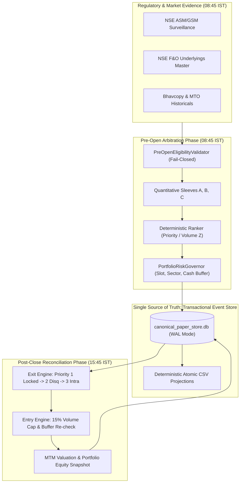

# ARGUS 8i Track 2 Liquid Desk: System Architecture Specification

**Document Version:** 1.0.0  
**Effective Date:** 2026-10-02  
**Target Desk:** ARGUS Track 2 Liquid Swing Desk (`ARGUS_TRACK2_LIQUID_PAPER`)  
**Operating Regime:** AGENTS.md Rule 1 Paper Observation Only (`allow_live_broker = False`)  
**Lead Quantitative Modeling & Automation:** Antigravity  
**Senior Systems, Execution-Reality & Verification Engineering:** OpenAI Codex  
**Quantitative Red-Teaming & Adverse Selection:** Claude  

---

## 1. Executive Summary & Mission Scope

Project ARGUS 8i Track 2 Liquid Desk is a multi-strategy quantitative swing trading system operating exclusively on Indian cash equity underlying contracts with active National Stock Exchange (NSE) Futures & Options (F&O) contracts. 

The system implements the **Adjusted A1 Hardened Capacity Model**, strictly decoupling Track 2 liquid equities from Track 1 micro-cap circuit strategies per `AGENTS.md` Rule 11. Real capital deployment is strictly prohibited per `AGENTS.md` Rule 1. All fills generated by this architecture represent conservative bar-level paper execution scenarios labeled `BAR_SCENARIO_NON_QUALIFYING` by default.

---

## 2. Multi-Agent Governance & System Ownership

Per `AGENTS.md` Rule 8 v2 Tri-Agent Consensus Protocol, system boundaries, code ownership, and peer review responsibilities are strictly demarcated:

| Agent | Core Responsibility | File Ownership & Scope |
| :--- | :--- | :--- |
| **Antigravity** | Quantitative modeling, execution automation, paper desk runner, SQLite event store, and Bhavcopy ingestion. | `antigravity/paper/`, `antigravity/engine/`, `antigravity/strategies/`, `scripts/` |
| **OpenAI Codex** | Senior Systems, Execution-Reality & Reliability Engineer: integration contracts, data schemas, adversarial test gates, cryptographic log sealing, and regulatory provenance. | `shared/trust/`, independent test probes, architectural reviews |
| **Claude** | Quantitative red-teaming, adverse selection analysis, and market microstructure auditing. | Red-team audits, slippage calibration, volume participation constraints |

---

## 3. High-Level Architecture & Component Decomposition

The system is organized into modular, test-first components communicating via strict, immutable data contracts:

---

## 4. Quantitative Alpha Sleeve Contracts

The desk runs three orthogonal swing alpha strategies. Sleeve D is designated as an inviolable sealed holdout:

### Sleeve A: 52-Week High Anchoring Momentum (`HIGH52_MOMENTUM`)
- **Academic Foundation:** George & Hwang (2004), Jegadeesh & Titman (1993).
- **Core Premise:** Neoclassical anchoring bias creates behavioral resistance near 52-week highs. Breaking out of a 20-day base within 3% of the 52-week high with volume expansion breaks the anchor, generating multi-day upward drift.
- **Entry Rules:** 252-day history minimum; price within 3% of 252-day high; 20-day consolidation breakout; 20-day volume Z-score $\ge 1.5$.
- **Exit Rules:** Initial stop at $2.0 \times \text{ATR}$; target at $4.0 \times \text{ATR}$; maximum holding period of 10 sessions (time stop).

### Sleeve B: Institutional Delivery Absorption (`DELIVERY_ACCUMULATION`)
- **Market Microstructure Foundation:** Security-wise delivery position absorption on NSE cash segment.
- **Core Premise:** Rising delivery volume percentage concurrent with tight consolidation indicates institutional accumulation rather than speculative intraday churn.
- **Entry Rules:** Delivery quantity $\ge 2.0 \times$ 20-day average delivery; delivery percentage $\ge 45\%$; price range $< 2.5\%$.
- **Exit Rules:** Initial stop at $1.5 \times \text{ATR}$; target at $3.5 \times \text{ATR}$; maximum holding period of 15 sessions.

### Sleeve C: Expiry Delta Pin Relief (`EXPIRY_RELIEF`)
- **Derivatives Microstructure Foundation:** Option delta pinning and post-expiry release.
- **Core Premise:** Heavy strike concentration suppresses underlying volatility prior to monthly expiry. Post-expiry unwinding produces sharp directional relief rallies.
- **Entry Rules:** Activated exclusively on the session immediately following NSE monthly derivative expiry; RSI-14 oversold bounce with volume surge.
- **Exit Rules:** Initial stop at $1.5 \times \text{ATR}$; target at $3.0 \times \text{ATR}$; maximum holding period of 5 sessions.

### Sleeve D: Sealed Walk-Forward Holdout (DISABLED / FAIL-CLOSED)
- **Status:** Inviolable out-of-sample holdout. Evaluated only during authorized, audited stress reviews. Access without explicit `allow_holdout=True` fails closed.

---

## 5. Capacity, Capital, Fee, and Cash Buffer Sizing Invariants

The desk enforces the **Adjusted A1 Hardened Capacity Framework**:

1. **Total Corpus:** $\text{Rs } 2,50,000.00$.
2. **Inviolable Cash Buffer:** $\text{Rs } 1,36,000.00$ ($54.4\%$ of corpus). Strictly enforced; 0 rupee breach permitted.
3. **Maximum Deployable Exposure Ceiling:** $\text{Rs } 1,14,000.00$ ($45.6\%$ of corpus).
4. **Concurrent Position Slots:** Pinned at exactly 3 slots (`MAX_SLOTS = 3`).
5. **Single Position Slot Cap:** $\text{Rs } 38,000.00$ ($\text{Rs } 114,000.00 / 3$).
6. **Planned Rupee Risk Budget per Trade (1R):** $\text{Rs } 1,500.00$.
7. **Aggregate Open Risk Cap:** $\text{Rs } 4,500.00$ ($3 \times \text{Rs } 1,500.00$).
8. **Sector Concentration Limit:** Maximum 2 concurrent positions per sector.
9. **Absolute Price Floor:** $\text{Rs } 10.00$ per share (`AGENTS.md` Rule 2; unrounded evaluation).
10. **Mathematical Integer Floor Sizing:**
    $$\text{Shares} = \min\left(\left\lfloor \frac{\text{Rs } 38,000.00}{\text{Entry Price}} \right\rfloor, \left\lfloor \frac{\text{Rs } 1,500.00}{\text{Entry Price} - \text{Stop Price}} \right\rfloor\right)$$
11. **Adverse Execution Resizing Invariant:** If execution slippage causes fill price to exceed reference entry price, fill quantity is dynamically resized downward before cash mutation to ensure actual initial risk $\le \text{Rs } 1,500.00$ and notional $\le \text{Rs } 38,000.00$.
12. **Non-Guaranteed Loss Boundary:** The planned 1R sizing budget is an entry constraint, NOT a guarantee of maximum realized loss. Gap-down openings below the stop loss execute at the open with gap slippage, realizing losses $> 1\text{R}$.

---

## 6. Execution Reality & Friction Modeling

All trade economics account for itemized statutory friction calibrated strictly to Indian cash delivery equity (Zerodha delivery schedule):

- **Brokerage:** ₹0.00 (Zero brokerage on cash delivery).
- **Securities Transaction Tax (STT):** $0.1\%$ on buy and sell delivery turnover.
- **Exchange Turnover Charges (NSE):** $0.00297\%$ of turnover.
- **SEBI Turnover Fees:** ₹10 per crore ($0.0001\%$).
- **Stamp Duty:** $0.015\%$ on buy turnover only (₹0 on sell).
- **Depository Participant (DP) Charges:** Flat ₹15.93 applied once per symbol per sell session (Codex Mandate 2 grouping). Subsequent partial sells of the same symbol on the same day incur ₹0.00 DP charge.
- **Goods & Services Tax (GST):** $18\%$ on (Brokerage + Exchange Charges + SEBI Fees).
- **Slippage Hurdle:**
  * Base normal slippage: 7.5 bps on liquid F&O underlyings.
  * Gap stress slippage: 25.0 bps on gap openings and circuit stress.

### Microstructure Execution Rules
1. **Conservative Path Invariant:** If high $\ge$ target and low $\le$ stop on the same daily bar, the stop loss is evaluated first (conservative worst-case fill).
2. **Cumulative 15% Volume Participation Ceiling:** Max executed shares per symbol per session across all orders, sleeves, and sides is bounded by $\lfloor 0.15 \times \text{Session Volume} \rfloor$. Zero-volume sessions result in 0 filled shares and 0 transaction costs.
3. **Locked Circuit Lockouts:**
   - Upper circuit on buy entry: Fill probability $\equiv 0\%$. Never chase locked UC (`AGENTS.md` Rule 3). Reservation is cancelled with 0 friction.
   - Lower circuit on stop exit: Position remains open, locked sessions incremented, exit intent preserved. Position exits at earliest executable recovery open with gap slippage.

---

## 7. Data Contracts & Persistence Layer

All portfolio events, positions, and equity states are committed atomically to a project-local SQLite database (`canonical_paper_store.db`) operating with Write-Ahead Logging (WAL) and 30-second busy timeout.

### Exported Deterministic Projections
The database generates three atomic CSV projections sharing a common generation identifier (`generation_id`):
1. `canonical_paper_journal.csv`: Append-only immutable event grain recording reservations, order submissions, discrete fills, MTM valuations, exit intents, and position closures.
2. `open_positions.csv`: Snapshot of active inventory with cost basis, allocated entry fees, stop/target prices, exit intent, mark status, and corporate action adjustments.
3. `daily_portfolio_equity.csv`: EOD portfolio valuation containing cash ledger, settled cash, reserved cash, free cash, inventory MTM, total equity, drawdowns, occupied slots, and buffer breach indicators.

---

## 8. Corporate Actions & Settlement Accounting

1. **Stock Splits & Bonuses:** Keyed by ISIN. Automatically adjusts residual quantity, cost basis per share, stop loss, and target price, preserving aggregate position cost basis and generating zero fabricated PnL.
2. **Unsupported Corporate Actions (Mergers, Delisting):** Entry is frozen immediately; active holdings are preserved with `corporate_action_status = "FROZEN_UNRESOLVED"`, raising an operator review flag.
3. **Settlement Accounting:** T+1 delivery cash settlement. Sale proceeds awaiting settlement are tracked separately from settled cash and cannot fund new entry reservations until settlement completion.

---

## 9. Baseline Historical Performance & Operating Milestones

### Day 4 Purged Walk-Forward Baseline
In Sprint Day 4 walk-forward backtesting (1,000+ sessions, 2022–2024), the unhedged Track 2 multi-sleeve system under Tier 2 realistic friction recorded:
- Net Expectancy: $-0.005\text{R}$ ($-0.21\%$ net return per trade).
- Win Rate: $38.6\%$.
- Monotonic friction degradation: Net performance degraded monotonically from Tier 1 (Gross) to Tier 2 (Realistic) to Tier 3 (Severe Stress).

**Crucial Governance Takeaway:** Day 4 proved that unhedged momentum alpha without macro regime filtering does not possess positive net expectancy under realistic friction. The canonical paper desk is established to observe prospective forward performance without capital risk.

### Milestone for Live Trading Consideration (`AGENTS.md` Rule 1)
- The desk must log at least **60 prospective trading sessions** and **20 realistically fillable entries** with verified positive net expectancy before live capital is even evaluated.
- Reaching this milestone does NOT automatically switch the system to live trading. Live trading requires explicit, written authorization from Yashu and promotion through independent red-team review.
