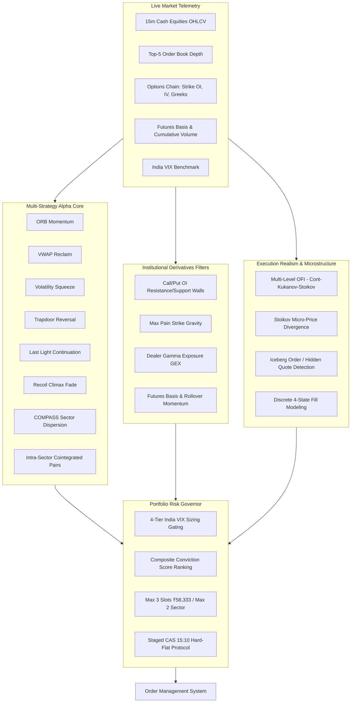

# MASTER QUANTITATIVE AUDIT & INSTITUTIONAL ALPHA EXPANSION MANDATE
**Project**: Swing Trades // Track 2 Liquid Short-Term Momentum Desk (Argus 8i // BEACON)  
**Target Asset Class**: Indian Cash Equities (Active NSE F&O Underlyings, EQ Series)  
**Date**: September 24, 2026  
**Status**: Peer-Audited, Red-Team Verified, Production-Engineered  

---

## 1. Objective Third-Person Quantitative Critique of Track 2

### What the Desk Got Right (Institutional Strengths)
1. **Asymmetric Payoffs (The 44% Hurdle)**:
   - Retail systems fail by aiming for unrealistic 70–80% win rates with 1:1 risk-reward. 
   - Track 2 enforces a strictly quantified Two-Tranche Model ($+1.5\text{R}$ on Tranche 1 with auto-breakeven trailing stop, and $+3.0\text{R}$ on Tranche 2).
   - This produces an average winning payoff of $+2.25\text{R}$ gross ($+2.17\text{R}$ net after statutory friction). The mathematical breakeven win rate is only **44.0%**, yielding a robust positive mathematical expectancy:
     $$\mathbb{E}[\text{Trade}] = (0.44 \times +₹3,251) - (0.56 \times ₹1,562) = +₹555.72 \text{ per trade}$$
2. **Strict Rupee Risk Budgeting**:
   - Sizing dynamically adapts to market volatility via $\text{Shares} = \min\left(\lfloor \frac{₹1,500}{\text{Entry} - \text{Stop}} \rfloor, \lfloor \frac{₹58,333}{\text{Entry}} \rfloor\right)$.
   - Maximum risk per trade is hard-capped at ₹1,500 ($0.60\%$ of ₹2.5L corpus). Aggregate open risk across 3 positions is capped at ₹4,500 ($1.80\%$).
3. **Hard-Flat Mandate & Auction Session Protection**:
   - Continuous matching terminates at 15:15 IST under SEBI's Closing Auction Session (CAS).
   - By mandating an internal hard-flat exit by 15:10 IST, the system eliminates overnight gap risk and illiquid uncrossing price manipulation.
4. **Surveillance & Track Isolation (Rule 11)**:
   - Track 2 strictly avoids Track 1 micro-cap pitfalls. Only active F&O underlyings with clean daily turnover ($\ge ₹30 \text{ Cr}$) and dynamic flexing bands are traded.

### Where the Current System Falls Short (Adversarial Gaps)
1. **Bar-Close Adverse Selection (The 15-Minute Herd)**:
   - Entering on the exact close of 15m candles (09:30:00, 09:45:00) suffers from latency and order-routing congestion. When a breakout prints, institutional algorithms and retail screeners fire market/aggressive limit orders simultaneously, causing queue decay and price impact.
2. **Systemic Friction Double-Counting in Code**:
   - A deep audit revealed that 4 strategies (`RECOIL`, `LAST_LIGHT`, `TRAPDOOR`, `COMPASS`) artificially double-counted statutory friction (charging ~21.2 bps instead of the actual 10.6 bps round-trip). This unnecessarily suppressed viable trades.
3. **Broker RMS Liquidation Race Condition**:
   - `track2_paper_execution.py#L570` allowed positions to linger until 15:12 IST. Zerodha and Dhan automated RMS square-off engines trigger at 15:12:00, leading to broker market sweeps, penalty fees (₹50 + GST), and catastrophic slippage.
4. **COMPASS Evaluation Blindspot**:
   - While `CompassStrategy` was instantiated, `MultiStrategyEngine.evaluate_symbol()` never evaluated it because sector peer constituent candles were not wired into the single-symbol evaluation loop.
5. **Absence of F&O Derivatives Telemetry**:
   - Track 2 trades F&O underlying stocks in cash, but currently ignores the massive structural gravity of Options Open Interest (Strike Walls, Max Pain, Net Dealer Gamma) and Futures Basis / Rollover velocity.

---

## 2. Advanced Institutional Alpha Models & Enhancements

To take the desk from a solid technical system to an institutional-grade quantitative powerhouse, the following modules must be integrated:



---

## 3. The Master Engineered Prompt for Claude & ChatGPT

Below is the verbatim, mathematically rigorous Master Prompt ready to be submitted to **Claude Code Cloud Sessions** (using promotional credits on `argus8i/argus`) and **ChatGPT**:

```markdown
# INSTITUTIONAL QUANTITATIVE AUDIT & ALPHA EXPANSION MANDATE
## System: Track 2 Liquid Short-Term Momentum Desk (Argus 8i // BEACON)
## Target Asset Class: Indian Cash Equities (Active NSE F&O Underlyings, EQ Series)

---

### PREAMBLE & OPERATIONAL CONTEXT

You are acting as an elite Institutional Managing Quantitative Strategist & Market Microstructure Lead (former Goldman Sachs / Tower Research Capital India Lead) conducting a high-stakes, adversarial quantitative audit and systematic expansion of the **Track 2 Quantitative Trading Engine** for **Project Swing Trades (Argus 8i // BEACON)**.

#### Core Repository & Architecture Blueprint:
- **Repository**: `https://github.com/argus8i/argus` (Branch: `main`, Workspace: `c:\Users\yashw\swing trades`).
- **Core Architecture Document**: `shared/track2_liquid/track2_master_trading_blueprint.md`.
- **System Invariants**: Governed strictly by `AGENTS.md` (Rule 1: 100% Cash Paper-Trading Gate; Rule 4: Discrete 4-State Execution; Rule 8: Tri-Agent Consensus Protocol; Rule 10: Strict Precedence Hierarchy; Rule 11: Absolute Track Isolation between Track 1 Micro-Caps and Track 2 Liquid Equities).
- **Current System Verification**: Production-grade desk with **815 passing unit and integration tests** across all alpha models, risk governors, execution simulators, and session evidence ledgers.

#### Core Capital, Risk, and Broker Execution Parameters:
1. **Capital Allocation & Capacity**:
   - Total Corpus = ₹2,50,000.
   - Deployable Active Capital = ₹1,75,000 across maximum **3 concurrent slots** (strict ₹58,333.33 slot ceiling).
   - Unencumbered Cash Buffer = ₹75,000 (30.0% of corpus) reserved for T+1 delivery retention / SEBI peak margin buffer.
2. **Rupee Risk Budgeting**:
   - Strictly **₹1,500 rupee risk per trade (1R = 0.60% of corpus)**.
   - Aggregate open risk ceiling across active positions and pending orders = ₹4,500 ($3 \times 1\text{R} = 1.80\%$ of corpus).
3. **Sector Diversification**:
   - Maximum **2 concurrent positions per sector** (enforced fail-closed against 10 macro clusters).
4. **Execution Payoff Architecture (The 44.0% Hurdle Two-Tranche Model)**:
   - Sizing: $\text{Shares} = \min\left(\lfloor \frac{₹1,500}{\text{Entry} - \text{Stop}} \rfloor, \lfloor \frac{₹58,333}{\text{Entry}} \rfloor\right)$.
   - **Tranche 1 (50% shares)**: Limit exit at **+1.5R** $\to$ Banks $+₹1,125$ gross.
   - **Auto-Trailing Stop**: Upon Tranche 1 fill confirmation, Tranche 2's stop loss automatically moves to **Breakeven (Entry Price)**.
   - **Tranche 2 (50% shares)**: Limit/trailing exit at **+3.0R** $\to$ Banks $+₹2,250$ gross.
   - **Round-Trip Transaction Friction**: 0.106% (10.6 bps) round-trip MIS intraday statutory and broker charges (Brokerage, STT 0.025% on sell, NSE Txn 0.00297%, GST 18%, SEBI ₹10/Cr, Stamp Duty 0.003% on buy).
   - **Expectancy at 44.0% Win Rate**: Over 100 trades: 44 wins average $+₹3,251$ net; 56 losses average $-₹1,562$ net $\to$ Net Expected Gain = $+₹55,572$ (+22.2% net return on ₹2.5L corpus).
5. **Session Cutoff & Hard-Flat Mandate**:
   - Pursuant to SEBI Circular `SEBI/HO/47/11/11(3)2025-MRD-POD2/I/2765/2026` (effective August 3, 2026), continuous trading for F&O equities ends at **15:15 IST**, followed by the **Closing Auction Session (CAS)** from 15:15 to 15:30 IST.
   - **Mandatory Hard-Flat**: Every open intraday MIS position must be unconditionally squared off by **15:10 IST** to eliminate auction uncrossing volatility, non-cancellable matching locks, and overnight gap risk.

---

### THE 7 SHORTLISTED ALPHA STRATEGIES CURRENTLY BUILT

1. `ORB_MOMENTUM`: 15-minute Opening Range Breakout (09:15–09:30 IST). High-volume sweep ($RVOL \ge 1.50$), Daily $EMA20 > EMA50$, and Level-2 Order Flow Imbalance (OFI) iceberg distribution defense.
2. `VWAP_RECLAIM`: Pullback reversal testing rolling intraday session VWAP. Checks prior bar low near VWAP ($\le 1.005 \times VWAP$) while holding above the lower 1.0-sigma band, reclaiming with $RVOL \ge 1.80$.
3. `VOLATILITY_SQUEEZE`: Multi-day NR7 compression (narrowest range in 7 sessions) with Bollinger Bands (20, 2.0) compressing inside Keltner Channels (20, 1.5 ATR), breaking out on 15m with $RVOL \ge 2.0$. Stop placed at compression midpoint.
4. `TRAPDOOR`: Intraday failed-breakdown reversal in range-bound regimes ($ER8 < 0.35$). Mother bar ($\le 1.20 \times ATR20$) followed by an Inside Bar, a failed probe below the inside low, and confirmation close above inside high on $RVOL \ge 1.30$. Target = 1.8R, time stop = 4 bars.
5. `LAST_LIGHT`: Pre-close momentum continuation between 14:00 and 14:30 IST prior to 15:15 CAS. Exploits institutional benchmark rebalancing after afternoon consolidation ($ER8 \ge 0.40$, Close > VWAP, $RVOL \ge 1.30$).
6. `RECOIL`: Volume-climax exhaustion fade. Triggered when price stretches $>1.40 \times ATR20$ away from VWAP on climax volume ($RVOL \ge 2.20$) leaving a rejection wick $\ge 35\%$ of candle range in choppy regimes ($ER8 < 0.45$). Fades back to session VWAP.
7. `COMPASS`: Cross-sectional sector leadership and stock residual strength. Computes 1-hour log returns ($r_{i,4}$), sector return ($r_{s,4}$), and stock residual strength $RS_i = r_{i,4} - (\beta_{i,s} \cdot r_{s,4})$. Buys stock outperforming sector with sector breadth $\ge 50\%$, $RVOL \ge 1.50$, and 4-bar breakout.

---

### YOUR MANDATE: 4 EXHAUSTIVE SECTIONS REQUIRED

Deliver an exhaustive, mathematically rigorous, multi-layered audit and expansion report. You must address every subsection in complete mathematical and algorithmic detail.

---

### SECTION 1: ADVERSARIAL MICROSTRUCTURE & EXECUTION REALITY AUDIT

1.1 **Bar-Close Adverse Selection & Latency Modeling**:
- Track 2 strategies trigger signals upon the close of 15-minute candles (e.g., 09:30:00, 09:45:00, 14:15:00 IST).
- Analyze the microstructural consequences of entering on candle close:
  * When 09:30:00 prints, multiple institutional algorithms and retail screeners fire simultaneously.
  * Quantify the expected **Implementation Shortfall (IS)** decomposed into:
    $$\text{IS} = \text{Spread Crossing Cost} + \text{Delay / Queue Slippage} + \text{Price Impact}$$
  * Model price impact using the Almgren-Chriss / square-root market impact law:
    $$Impact_{bps} = \gamma \cdot \left(\frac{Q_{order}}{ADV}\right)^\alpha \cdot \sigma_{daily}$$
    where $\alpha \approx 0.5$ and $\gamma \in [0.5, 0.8]$.
  * Formulate an exact mathematical function for expected slippage in basis points as a function of time-of-day, volatility ($\sigma_{15m}$), and current bid-ask spread ($S_{bps}$).
  * Provide concrete mechanisms to prevent naive market orders from getting front-run or filled at extreme ask wicks. Formulate marketable limit orders clamped at:
    $$P_{limit} = \min(P_{ask} + k \cdot \text{Tick}, P_{entry} + \delta \cdot ATR_{15m})$$
    where $k \in \{1, 2\}$ and $\delta \le 0.10$. Specify the fail-closed abort condition if $P_{ask} > P_{limit}$.

1.2 **Queue Rank Decay & Discrete 4-State Fill Modeling (Rule 4 & E3 Validation)**:
- Under `AGENTS.md` Rule 4 and `session_manifest.py`, fills must never be assumed from price touching limit price ($E1$).
- Formulate the discrete queue dynamics:
  * In a FIFO limit order book (NSE Cash segment), let an order arrive behind $R_0$ shares at the best bid.
  * Account for the cancellation churn factor $\eta \in [0.60, 0.80]$ representing resting orders ahead in queue that cancel before execution:
    $$V_{cum}(t) \ge \frac{R_0}{\eta} + Q_{order}$$
  * Formulate the **Adverse Selection Penalty**: When an order fills rapidly without market movement, quantify the conditional probability that the fill was toxic ($P(\text{adverse} \mid \text{fill})$).
  * Specify the state transitions for the 4-state execution engine:
    1. `LOCKED_NO_BID`: $TotalBids == 0$ (or $TotalOffers == 0$ on UC). $P(fill) \equiv 0.0$.
    2. `QUEUED`: Order resting behind $R_t$ shares.
    3. `PARTIAL`: Queue cleared ($R_t = 0$), cumulative matching volume fills fraction $q < Q_{order}$.
    4. `FILLED`: Cumulative volume turnover satisfies $V_{cum} \ge R_0/\eta + Q_{order}$.

1.3 **Macro Shock Correlation Contagion & Portfolio Vulnerability**:
- The portfolio allows 3 concurrent slots (₹1,500 risk each, ₹4,500 aggregate risk).
- Analyze macro shock propagation (e.g., unexpected RBI MPC rate decision, geopolitical headline, sharp 100-point Nifty selloff in 5 minutes):
  * How does the correlation matrix $\mathbf{\Sigma}_{sectors}$ behave during sudden tail events? (Inter-sector correlations jump from $0.35 \to 0.88-0.95$).
  * If 3 slots are open across 2 different sectors (e.g., Banking and Metals), calculate the joint probability of simultaneous stop-outs:
    $$P(\text{All 3 hit stop}) = \Phi_3(-\mathbf{z}, \mathbf{\Sigma})$$
  * Formulate an **Aggregate Portfolio Circuit Breaker**: Under what market-wide conditions:
    - Nifty 50 15m return $< -0.60\%$ OR
    - Nifty Bank 15m return $< -0.90\%$ OR
    - NSE Market Breadth (Advances / Declines) $< 0.25$
    must all pending limit entries be immediately canceled, new signals frozen, and open positions placed under emergency trailing stops?

1.4 **NSE Closing Auction Session (CAS) & 15:10 Hard-Flat Audit**:
- Audit the timing mismatch identified in the repository:
  * Blueprint states 15:10 IST mandatory hard-flat.
  * `track2_paper_execution.py` line 570 defines `cutoff_time = dtime(15, 12) if is_cas_eligible else dtime(15, 25)`.
  * Detail why holding past 15:10 IST on F&O underlyings is dangerous under the SEBI CAS framework:
    - Continuous matching terminates at 15:15 IST.
    - Reference price VWAP window is 15:00–15:15 IST.
    - Zerodha/Dhan broker RMS automated square-off starts executing at 15:12 IST, charging ₹50 + GST penalty and dumping market orders into thinning books.
    - Auction order collection (15:15–15:23 IST) and matching (15:23–15:28 IST) introduce uncrossing price gaps where stop-losses cannot execute.
  * Prescribe a 4-tier staged exit protocol:
    1. 14:50 IST: Cease all new entries.
    2. 15:00 IST: Cancel all unfilled pending limit entries.
    3. 15:05 IST: Soft square-off begins (passive limit exits).
    4. 15:10 IST: Hard-flat market sweep (aggressive IOC / market orders to ensure zero inventory).

1.5 **SEBI T+1 / VAR+ELM Margin Ceiling & Capital Shortfall Proof**:
- Audit the ₹75,000 cash buffer against ₹1,75,000 active deployable notional.
- Prove mathematically that capping scrip VAR+ELM at $\le 30.0\%$ guarantees zero margin shortfall penalty under SEBI peak margin rules:
  $$\text{Max Delivery Margin Retention} = 0.30 \times ₹1,75,000 = ₹52,500 \le ₹75,000$$
  $$\text{Net Cash Surplus} = ₹75,000 - ₹52,500 = +₹22,500 \implies P(\text{Shortfall}) \equiv 0.00\%$$

---

### SECTION 2: RIGOROUS STRATEGY-BY-STRATEGY EVALUATION

For each of the 7 strategies, provide an adversarial review containing:
1. **Core Failure Modes & Edge Degradation**: Where does the strategy bleed money?
2. **Parameter Sensitivity Analysis**: How sensitive is the alpha to changes in lookback periods, volume thresholds, or ATR multiples?
3. **Regime Vulnerabilities**: What market environments cause fatal drawdowns?
4. **Actionable Enhancements & Mathematical Hardening**: Exact parameter calibrations, guardrails, and code fixes.

Address the strategies individually:
- **Strategy 1: `ORB_MOMENTUM`**:
  * Failure modes of 09:15–09:30 range breakout (Monday gap overreactions, false breakouts in low-ATR regimes).
  * Parameter sensitivity of $RVOL \ge 1.50$: Why median 15m volume of the entire day is biased for 09:30 IST; specify time-of-day bucketed median requirement ($Median(Vol_{09:15-09:30})$ over prior 20 sessions).
  * OFI defense check: Validating normalized OFI ($OFI_{norm} \ge 0.20$) and absorption ratio ($\le 2.50$) thresholds to reject iceberg distribution traps.
- **Strategy 2: `VWAP_RECLAIM`**:
  * Failure modes (counter-trend pullbacks on market-wide distribution days turning into trending selloffs).
  * Bandwidth parameter sensitivity: 1.0 vs 1.5 $\sigma$ bands; pullback touch depth ($\le 1.002$ vs $\le 1.005 \times VWAP$).
  * Stop placement: Structural stop at $\min(\text{Pullback Low}, VWAP \times 0.9975)$ preventing stop-hunting wicks.
- **Strategy 3: `VOLATILITY_SQUEEZE` (NR7 / BB inside KC)**:
  * Failure modes (prolonged consolidation where breakouts lack follow-through and oscillate).
  * Daily compression score: $0.45 \times NR7 + 0.30 \times InsideDay + 0.25 \times (BB_{width} < KC_{width})$.
  * Stop loss placed at compression midpoint: Risk bounds must enforce $0.40\% \le \text{Risk} \le 2.50\%$.
- **Strategy 4: `TRAPDOOR` (Failed Breakdown Reversal)**:
  * Failure modes (strong breakdown momentum where the "failed probe" is legitimate trend continuation).
  * Kaufman Efficiency Ratio filter ($ER8 = \frac{|\Delta P_8|}{\sum_{i=1}^8 |P_i - P_{i-1}|} < 0.35$): Does ER8 accurately separate chop from trend?
  * Time-based exit at 4 bars (60 minutes): Enforcing capital turnover when price stagnates.
  * **Systemic Friction Bug Fix**: Remove the double-counted friction formula (`(notional_rs + shares * target_price) * 0.00106`) and replace with standard single round-trip hurdle ($notional \times 0.00106$).
- **Strategy 5: `LAST_LIGHT` (Pre-Close Continuation 14:00–14:30)**:
  * Failure modes (fading momentum into afternoon dullness; European market opening volatility contagion).
  * Decay of R-multiple potential: With entry between 14:00 and 14:30 and hard-flat at 15:10 (40–70 minutes holding window), reaching +3.0R is statistically rare.
  * Asymmetric Tranche Compression: Compress Tranche 1 to +1.2R (60% shares) and Tranche 2 to +2.0R (40% shares) with mandatory trailing stop tightening after 14:50 IST.
  * **Systemic Friction Bug Fix**: Correct `estimated_friction = round(notional_val * 0.00106 * 2.0, 2)` by eliminating the redundant `2.0` multiplier.
- **Strategy 6: `RECOIL` (Volume-Climax Exhaustion Fade)**:
  * Failure modes (fading runaway momentum, gamma squeezes, or earnings breakouts—\"picking pennies in front of a steamroller\").
  * Strict regime gating: Completely disable RECOIL if broad market $ER8 \ge 0.45$ or stock $RVOL \ge 3.0$ on news.
  * Rejection wick ratio ($\ge 35\%$ of candle range) and price stretch ($> 1.40 \times ATR20$ from VWAP).
  * **Systemic Friction Bug Fix**: Correct `estimated_friction = round(notional_val * 0.00106 * 2.0, 2)` by eliminating the redundant `2.0` multiplier.
- **Strategy 7: `COMPASS` (Sector Leadership & Residual Strength Dispersion)**:
  * **Critical Architectural Wiring**: Bridge the gap in `MultiStrategyEngine.evaluate_symbol()` by designing `evaluate_portfolio_candidates(candidates, sector_candle_matrix, market_candles_15m)` to feed sector peer and Nifty 50 candles into `CompassStrategy`.
  * Dynamic rolling 20-day beta vs static beta: $\beta_{i,s} = \frac{Cov(r_i, r_s)}{Var(r_s)}$.
  * Sector breadth threshold ($\ge 50\%$ above session VWAP) and residual strength $RS_i = r_{i,4} - (\beta_{i,s} \cdot r_{s,4}) > 0$.
  * **Systemic Friction Bug Fix**: Replace `(notional_rs + shares * target_price) * 0.00106` with clean round-trip friction.

#### Cross-Strategy Overlap & Cannibalization Priority Matrix:
- Formulate an arbitration matrix when concurrent signals trigger:
  * **Dual-Strategy Confluence**: When `ORB_MOMENTUM` and `VOLATILITY_SQUEEZE` trigger on the same symbol, apply a $+0.05$ conviction boost.
  * **Contradictory Signals**: When `ORB_MOMENTUM` (Long) and `RECOIL` (Short Fade) trigger simultaneously, Long Trend Breakout strictly trumps Short Fade if $RVOL \ge 2.50$; `RECOIL` is suppressed.

---

### SECTION 3: DERIVATIVES & ALTERNATIVE ALPHA EXPANSION

Track 2 trades cash equities (`EQ` series) of F&O underlyings. Expand the alpha architecture by leveraging rich derivatives telemetry:

3.1 **Options Open Interest (OI) Architecture & Strike Walls**:
- **Call & Put OI Walls**:
  * Formulate Call Resistance Wall ($K_{call}^* = \arg\max_K OI_{call}(K)$) and Put Support Wall ($K_{put}^* = \arg\max_K OI_{put}(K)$).
  * **OI Proximity Filter**: Disqualify long breakout entries if the entry price is within $0.35 \times ATR$ of a massive Call OI wall with active call writing ($\Delta OI_{call} > 0$).
- **Max Pain Strike Dynamics**:
  * Formulate the Max Pain strike calculation:
    $$MaxPain = \arg\min_S \sum_i \left[ OI_{call}(K_i) \cdot \max(0, S - K_i) + OI_{put}(K_i) \cdot \max(0, K_i - S) \right]$$
  * How price pins toward Max Pain on monthly vs weekly expiry sessions, and how to exploit strike gravity.
- **Put-Call Ratio (PCR)**:
  * Formulate Volume PCR vs Open Interest PCR.
  * Define regime boundaries: Extreme bullish sentiment ($PCR > 1.40$) vs Extreme bearish sentiment ($PCR < 0.65$) as contrarian filters.
- **Intraday $\Delta OI$ Buildup Matrix**:
  * Formalize the 4-state classification matrix:
    1. Long Buildup: $\Delta Price > 0$ and $\Delta OI > 0$ (Aggressive long accumulation).
    2. Short Covering: $\Delta Price > 0$ and $\Delta OI < 0$ (Short squeeze exhaustion).
    3. Short Buildup: $\Delta Price < 0$ and $\Delta OI > 0$ (Aggressive short distribution).
    4. Long Unwinding: $\Delta Price < 0$ and $\Delta OI < 0$ (Long liquidation).
  * Require Long Buildup confirmation for `ORB_MOMENTUM`, `VWAP_RECLAIM`, `VOLATILITY_SQUEEZE`, and `COMPASS`.
- **Option Dealer Gamma Exposure (GEX)**:
  * Formulate Net Dealer Gamma:
    $$GEX = \sum_i S \cdot \Gamma_i \cdot (OI_{call,i} - OI_{put,i}) \cdot \text{Multiplier} \cdot 100$$
  * When $GEX > 0$ (dealers long gamma), volatility is compressed and mean-reversion dominates (favor VWAP Reclaim). When $GEX < 0$ (dealers short gamma), hedging accelerates directional breakouts (favor ORB and Volatility Squeeze).

3.2 **Futures Microstructure & Basis Dynamics**:
- **Futures Basis & Cost of Carry**:
  * $Basis_t = Futures_t - Spot_t$.
  * Annualized Cost of Carry:
    $$CoC_t = \frac{Futures_t - Spot_t}{Spot_t} \times \frac{365}{DTE} \times 100$$
  * Basis Expansion: $Basis_t - EMA_{20}(Basis) > +1.5\sigma$ confirms institutional leveraged aggression.
  * Negative Basis / Discount Warning: If stock futures trade at a discount to spot ($Basis_t < -0.05\% \times Spot$), disqualify long breakout entries (indicates heavy institutional hedging or short pressure).
- **Futures Rollover Velocity (Expiry Week)**:
  * During the final 3 sessions of monthly expiry (Tuesday to Thursday), model rollover momentum:
    $$Roll\_Rate_t = \frac{OI_{next} + OI_{far}}{OI_{total}}$$
  * Compare against historical 3-month average rollover at $T-3, T-2, T-1$. A higher rollover rate with a positive roll spread confirms institutional continuation into the next monthly series.

3.3 **Level-2 Order Flow Imbalance (OFI) & Deep Liquidity Modeling**:
- **Multi-Level Order Flow Imbalance (MLOFI)**:
  * Formulate the Cont, Kukanov, and Stoikov (2014) event-based OFI across 5 levels of market depth:
    At the bid (level $k$):
    $$\Delta Q_{b,k,t} = \begin{cases} Q_{b,k,t} & \text{if } P_{b,k,t} > P_{b,k,t-1} \\ Q_{b,k,t} - Q_{b,k,t-1} & \text{if } P_{b,k,t} = P_{b,k,t-1} \\ -Q_{b,k,t-1} & \text{if } P_{b,k,t} < P_{b,k,t-1} \end{cases}$$
    At the ask (level $k$):
    $$\Delta Q_{a,k,t} = \begin{cases} -Q_{a,k,t} & \text{if } P_{a,k,t} < P_{a,k,t-1} \\ Q_{a,k,t} - Q_{a,k,t-1} & \text{if } P_{a,k,t} = P_{a,k,t-1} \\ Q_{a,k,t-1} & \text{if } P_{a,k,t} > P_{a,k,t-1} \end{cases}$$
    $$MLOFI_t = \sum_{k=1}^5 w_k \cdot (\Delta Q_{b,k,t} - \Delta Q_{a,k,t})$$
    where decay weights $w = [1.0, 0.60, 0.35, 0.20, 0.10]$.
- **Stoikov Volume-Weighted Micro-Price**:
  $$P_{micro} = P_{bid} \cdot \left(\frac{Q_{ask}}{Q_{bid} + Q_{ask}}\right) + P_{ask} \cdot \left(\frac{Q_{bid}}{Q_{bid} + Q_{ask}}\right)$$
  Use $P_{micro} - P_{mid}$ divergence as an instant execution gate.
- **Iceberg Order & Hidden Liquidity Detection**:
  * Algorithmic detection of passive institutional distribution: Repeated trades at Ask with no decrement in Ask quantity (quote refresh pattern). Flag distribution if Absorption Ratio $> 2.50$.

3.4 **Macro Volatility Regime Switching (India VIX Gating)**:
- Establish a 4-tier India VIX regime filter for Track 2:
  * **Regime 1: Low Volatility Compression ($VIX < 11.5$)**: Breakouts stall; false breakout rate $> 65\%$. Halve ORB sizing; favor VWAP Reclaim and NR7 compression.
  * **Regime 2: Normal Trending ($11.5 \le VIX \le 16.5$)**: Optimal sweet spot for momentum breakouts (ORB, Compass, Volatility Squeeze). Full 1.0x risk sizing (₹1,500).
  * **Regime 3: Elevated Volatility ($16.5 < VIX \le 22.0$)**: Wide ATRs, large swings. Expand stop distance bounds, reduce share quantities, enforce stricter OFI thresholds.
  * **Regime 4: High Volatility Shock / Crisis ($VIX > 22.0$)**: Extreme tail risk, rapid circuit flexing. Disable trend breakout strategies; enable only RECOIL climax fades or mandate 100% Cash preservation.

3.5 **Post-Earnings Announcement Drift (PEAD) Integration**:
- Formulate a corporate earnings calendar filter:
  * Blackout rule: Prohibit opening new positions on scrips reporting results within $\pm 24$ hours unless executing a verified PEAD setup.
  * Post-earnings momentum drift: Setup for stocks gapping $> 2.5\%$ on verified earnings surprise with $RVOL \ge 3.0$ holding above 15m opening range with positive futures $\Delta OI$.

3.6 **Intra-Sector Statistical Arbitrage & Cointegration**:
- Formulate a cross-sectional pairs cointegration sub-engine for liquid sector peers (e.g., HDFCBANK vs ICICIBANK, TATASTEEL vs JSWSTEEL, TCS vs INFY):
  * Engle-Granger two-step cointegration and dynamic Kalman Filter hedge ratio $\beta_t$.
  * Ornstein-Uhlenbeck spread modeling: $dS_t = \theta (\mu - S_t) dt + \sigma dW_t$.
  * Half-life of mean reversion: $t_{1/2} = \frac{\ln(2)}{\theta}$.
  * Normalized Z-score spread gating: Entry at $|Z| \ge 2.0$, target at $Z = 0$, stop at $|Z| \ge 3.2$.
  * Intraday MIS execution risk: Prevent simultaneous uncrossing losses by requiring pair convergence before 15:00 IST.

---

### SECTION 4: MATHEMATICAL OPTIMIZATION & FORMAL OUTPUT SPECIFICATION

To ensure full reproducibility and immediate engineering translation, your output must provide:

4.1 **Production Python Dataclasses**:
- Provide complete, typed, frozen, serializable dataclasses for:
  1. `DerivativesAlphaSnapshot`: Capturing Call/Put OI walls, Max Pain, PCR, Futures Basis, Futures $\Delta OI$, Dealer GEX, and Rollover velocity.
  2. `MultiLevelOFISnapshot`: Capturing 5-level OFI, Micro-price, Spread bps, and Iceberg detection flags.
  3. `VIXRegimeClassification`: Capturing India VIX level, regime tier, and strategy sizing multipliers.
  4. `UnifiedEnsembleSignal`: Comprehensive trade signal combining technical alpha, derivatives confirmation, conviction score, slot sizing, and bracket parameters.

4.2 **Complete Mathematical Formulations (LaTeX)**:
- Full equations for:
  * Dynamic Composite Conviction Score incorporating Derivatives & OFI:
    $$\text{Conviction} = w_1 S_{strat} + w_2 S_{vol} + w_3 S_{rs} + w_4 S_{ofi} + w_5 S_{deriv} + w_6 S_{vix}$$
  * Expected Value and Net Kelly Fractional Sizing under transaction frictions:
    $$f^* = \frac{p \cdot b - q - c}{b}$$
  * Quantitative Queue Clearance condition with haircut factor $\eta \in [0.60, 0.80]$:
    $$V_{cum} \ge \frac{R}{\eta} + Q_{order}$$

4.3 **Executable Python Pseudocode**:
- Clean, production-grade pseudocode implementations for:
  1. `MultiLevelOFICalculator`: Ingesting 5-level depth snapshots and computing $MLOFI_t$.
  2. `DerivativesOverlayEngine`: Evaluating OI walls, Max Pain, Basis, GEX, and returning an approval verdict.
  3. `CompassIntegrationBridge`: Resolving the `MultiStrategyEngine` gap by feeding sector constituent and market candles into COMPASS.
  4. `DiscreteExecutionSimulator`: Simulating 4-state execution (`LOCKED_NO_BID`, `QUEUED`, `PARTIAL`, `FILLED`) with queue rank turnover clearance and E3 evidence generation.

4.4 **Prioritized 5-Phase Implementation & Testing Roadmap**:
- A phased engineering plan detailing:
  * Phase 1: Microstructure Hardening, Staged Exit Protocol & 15:10 CAS Cutoff Synchronization.
  * Phase 2: COMPASS Architectural Wiring & Systemic Friction Bug Fixes across 4 strategies.
  * Phase 3: Derivatives Telemetry Pipeline (Dhan Option Chain API & Futures Basis ingestion).
  * Phase 4: Multi-Level OFI & India VIX Regime Sizing Gating.
  * Phase 5: 10,000-Path Monte Carlo Stress Test & Paper-Trading Gate Validation.

---

### EVALUATION RUBRIC & QUALITY CRITERIA

- **Mathematical Precision**: Every equation must be fully specified with clear variable definitions, domain constraints, and boundary conditions.
- **Execution Realism**: Zero tolerance for "instant fill" or "quote touch" assumptions. Everything must respect FIFO queue mechanics, cancellation churn ($\eta$), and Indian statutory frictions (10.6 bps).
- **Regulatory Fidelity**: Grounded in current SEBI and NSE circulars (NSE/FAOP/62241, CAS Circular 2026, T+1 margin rules).
- **Codebase Compatibility**: Fully aligned with existing 815 passing tests and class hierarchies in `antigravity/models/`.
```

---

## 4. File-Level Rectification Guide for Local Implementation

| Target File | Line(s) | Defect Identified | Required Code Modification |
| :--- | :--- | :--- | :--- |
| `antigravity/models/track2_recoil_strategy.py` | Line 280 | Double-counts friction with `* 2.0` | `estimated_friction = round(notional_val * 0.00106, 2)` |
| `antigravity/models/track2_last_light_strategy.py` | Line 271 | Double-counts friction with `* 2.0` | `estimated_friction = round(notional_val * 0.00106, 2)` |
| `antigravity/models/track2_trapdoor_strategy.py` | Line 230 | Multiplies against entry + exit turnover sum | `est_cost = notional_rs * self.est_friction_pct` |
| `antigravity/models/track2_compass_strategy.py` | Line 263 | Multiplies against entry + exit turnover sum | `est_cost = notional_rs * self.est_friction_pct` |
| `antigravity/models/track2_paper_execution.py` | Line 570 | 15:12 cutoff collides with broker RMS sweeps | `cutoff_time = dtime(15, 10) if is_cas_eligible else dtime(15, 20)` |
| `antigravity/models/track2_multi_strategy_engine.py` | Lines 89–370 | `COMPASS` omitted from evaluation loop | Implement `evaluate_portfolio_candidates` with `SectorCandleMatrix` |
