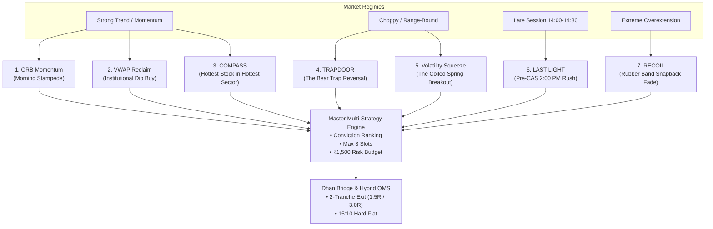

# Project Swing Trades: The Track 2 Quantitative Trading Blueprint
**A Plain-English Strategic Architecture for Indian Liquid Equities (NSE F&O Underlyings)**

---

## Executive Summary: How the Desk Makes Money

Most retail traders fail because they look at indicators (like RSI or MACD) in isolation, risk too much on single trades, and try to predict the market. 

Our system does not predict the future. It operates like a casino or an institutional market maker:
1. **Regime-Aware Diversity:** We do not rely on a single strategy. If the market is trending, our trend engines fire. If the market is choppy, our trap-reversal engines fire.
2. **Asymmetric Payoffs (The 44% Hurdle):** When we lose, we lose exactly **₹1,500 (1R)**. When we win, we bank profits at **+1.5R** and **+3.0R** (averaging **+2.25R**). Because of this payoff ratio, **we only need to win 44 out of 100 trades to be consistently profitable**. Even with 56 losing trades, the system compounds net positive expectancy.
3. **Strict Portfolio Capacity:** We never hold more than **3 positions at a time** (₹58,333 max notional per slot) and never more than 2 in the same sector.
4. **Hard-Flat Discipline:** Continuous matching on NSE ends at 15:15 IST due to the new Closing Auction Session (CAS). Every single intraday position is automatically closed by **15:10 IST**, eliminating overnight gap risk and auction penalty locks.

---

## The 7 Shortlisted Alpha Models Explained in Plain English



---

### 1. The Morning Stampede (`ORB_MOMENTUM`)
* **The Analogy:** A dam breaking open at 09:15 AM.
* **The Story:** When the market opens, overnight news and pent-up retail/institutional orders flood in. The first 15 minutes (09:15–09:30 IST) establish the high-water mark and the floor. When a top liquid stock blasts through its 15-minute high with heavy volume ($\ge 1.5\times$ normal), it means big institutional buyers are aggressively sweeping the order book.
* **How It Makes Money:** We enter on the 15-minute breakout, set our stop at the bottom of the breakout bar, bank 50% profit at +1.5R, move our stop to breakeven, and let the remaining 50% run to +3.0R.
* **Best Market:** High-energy trend mornings, earnings announcements, or gap-and-go days.

---

### 2. The Institutional Bargain Hunter (`VWAP_RECLAIM`)
* **The Analogy:** Buying a prime house at a temporary discount during an open house.
* **The Story:** VWAP (Volume-Weighted Average Price) is the true average price big institutions paid throughout the day. Portfolio managers are judged on whether they buy below or near VWAP. When a strong stock opens high, profit-takers push it down toward VWAP between 10:00 AM and 11:30 AM. When the price touches VWAP, institutions step in to buy the dip, pushing it back above VWAP.
* **How It Makes Money:** We don't guess where the bottom is. We wait for the stock to punch back above VWAP on above-average volume. That confirms institutional buyers are back. We buy the reclaim with a stop below the pullback low.
* **Best Market:** Strong trending stocks taking a healthy morning breath.

---

### 3. The Bear Trap (`TRAPDOOR`)
* **The Analogy:** Walking on a trapdoor that snaps shut on your foot.
* **The Story:** In sideways or choppy markets, amateur short-sellers look for a breakdown below the previous bar's low. The price dips below the floor for a few minutes. Amateurs jump in shorting, placing their stops right above the range. But instead of plunging, institutional buyers absorb the selling and push the price right back inside!
* **How It Makes Money:** The trapped short-sellers are forced to buy back their positions to cut their losses, while breakout buyers jump in. This double-wave of buying triggers an aggressive squeeze upward. We buy the exact bar that reclaims the broken level, set a tight stop at the trap low, and target a 1.8R squeeze.
* **Best Market:** Choppy, range-bound days where normal breakouts fail and trap people.

---

### 4. The Coiled Spring (`VOLATILITY_SQUEEZE / NR7`)
* **The Analogy:** Compressing a heavy steel spring until it cannot compress any further.
* **The Story:** Markets alternate between high volatility and low volatility. When a stock spends 7 consecutive days in a super-tight range (NR7 = Narrowest Daily Range in 7 days) and its Bollinger Bands squeeze inside its Keltner Channels, it means energy is building up and a massive directional move is imminent.
* **How It Makes Money:** We identify these coiled springs before 09:15 AM. The moment the stock breaks out on its 15-minute chart with expanding volume, the spring unleashes. We ride the multi-hour expansion.
* **Best Market:** After long periods of dull consolidation or pre-earnings compression.

---

### 5. The 2:00 PM Power Rush (`LAST LIGHT`)
* **The Analogy:** The final 100-meter sprint in a marathon.
* **The Story:** Between 12:00 PM and 2:00 PM, trading slows down (lunch hours in India and European open). But starting at 2:00 PM, institutional desks, mutual funds, and foreign funds rush to finish their daily rebalancing orders before continuous trading closes at 15:15 IST.
* **How It Makes Money:** A stock that has been strong all day and suddenly breaks out of afternoon consolidation between 14:00 and 14:30 IST has massive institutional urgency behind it. We enter for a quick 30-to-45-minute sprint, bank fast profits, and close 100% flat at 15:10 IST.
* **Best Market:** Late afternoon momentum continuation.

---

### 6. The Rubber Band Snapback (`RECOIL`)
* **The Analogy:** Stretching a rubber band as hard as you can until it snaps back to your hand.
* **The Story:** Sometimes a stock moves too far, too fast due to retail FOMO or panic stop runs. It stretches $>1.4\times\text{ATR}$ away from VWAP on a massive volume spike ($\ge 2.2\times$ normal). But smart money uses that frenzy to exit their positions, leaving a giant "wick" (rejection tail) on the candle.
* **How It Makes Money:** When buyers or sellers run out of gas, the price violently snaps back toward its equilibrium (VWAP). We trade the snapback toward VWAP with a tight stop right at the extreme tip of the spike.
* **Best Market:** Overextended, wild emotional spikes in choppy markets.

---

### 7. The Winning Horse in the Fastest Cart (`COMPASS`)
* **The Analogy:** Betting on the best horse in the strongest stable.
* **The Story:** Stocks don't move alone; they move in sectors (IT, Auto, Banking, Pharma). If the Auto sector is up +2.5% and 80% of auto stocks are green, buying the single strongest stock in that sector gives you a powerful structural tailwind.
* **How It Makes Money:** Even if the overall Nifty index is choppy, sector dispersion always creates isolated winners. COMPASS mathematically measures which sector has the highest breadth, finds the stock with the greatest residual strength within that sector, and allocates capital exclusively to the leader.
* **Best Market:** Sector rotation and dispersion regimes.

---

## The Master Execution Engine: How It Works Day-to-Day

```
 09:00 - 09:08 IST  [Pre-Open Phase]
                    • Scans F&O universe (Mcap ₹4k-75k Cr, DTV >= ₹30 Cr).
                    • Rotates the Top 20 liquid scrips into dynamic_universe.json.
                    • Pre-market check: flags NR7 / Volatility Squeeze setups.

 09:15 - 09:30 IST  [Opening Range Formation]
                    • Dhan feed streams live 1-second ticks.
                    • Forms 15-minute Opening Range candles (High, Low, VWAP).

 09:30 - 14:00 IST  [Active Multi-Strategy Scanning]
                    • All 7 strategies evaluate every 15-minute candle close.
                    • Composite Conviction Scorer ranks signals:
                      Score = 0.35*Base + 0.30*Volume + 0.20*RelativeStrength + 0.15*OFI
                    • Portfolio Allocator fills max 3 slots (max 2 per sector).
                    • Rupee Risk: strictly ₹1,500 risk per trade.

 14:00 - 14:30 IST  [LAST LIGHT Window]
                    • Evaluates late-session rebalancing breakouts.

 15:10 IST          [MANDATORY HARD-FLAT]
                    • Every open MIS intraday trade is unconditionally squared off.
                    • Zero positions allowed into the 15:15-15:35 Closing Auction.
```

---

## The Risk & Payoff Math: Why 44% Win Rate Wins

Let us look at the actual mathematics of our Two-Tranche Exit Model:

$$\text{Trade Sizing} = \min\left(\frac{₹1,500}{\text{Entry} - \text{Stop}}, \frac{₹58,333}{\text{Entry}}\right)$$

### On a Winning Trade:
* **Tranche 1 (50% shares):** Exits at **+1.5R** $\to$ Banks **+₹1,125 gross**.
* **Auto-Trailing Stop:** Once Tranche 1 fills, Tranche 2's stop automatically moves to **Breakeven (Entry Price)**.
* **Tranche 2 (50% shares):** Runs to **+3.0R** $\to$ Banks **+₹2,250 gross**.
* **Combined Win:** $+₹3,375$ gross ($- ₹124$ round-trip MIS friction) $\approx \mathbf{+₹3,251 \text{ net profit}}$.

### On a Losing Trade:
* Both tranches hit the initial stop loss.
* **Combined Loss:** $-₹1,500$ ($- ₹62$ round-trip friction) $\approx \mathbf{-₹1,562 \text{ net loss}}$.

### Expected Value over 100 Trades at 44% Win Rate:
* $44 \text{ Wins} \times +₹3,251 = \mathbf{+₹143,044}$
* $56 \text{ Losses} \times -₹1,562 = \mathbf{-₹87,472}$
* **Net Expected Profit = $+₹55,572$ on a ₹2.5 Lakh portfolio (+22.2% return over 100 trades)!**

---

## Tri-Agent Roles for Full Engineering

| Agent | Core Responsibility | Cloud / Local Tooling |
| :--- | :--- | :--- |
| **Antigravity (Orchestrator)** | Desk Architecture, Production OMS, Dhan Feed Bridge, Local Verification | Local Python Desk (`pytest`, Web UI Server, Dhan Bridge) |
| **Claude (Red-Team Auditor)** | Microstructure Modeling, 10,000-Path Monte Carlo Stress Tests, Adverse Selection | Anthropic Cloud Sessions ($100 credit on `argus8i/argus`) |
| **ChatGPT / Codex (Reliability)** | Execution Realism, SQLite Capacity Ledger, Concurrency Locks, Data Contracts | Systems Code Reviews & Provable Invariant Checks |
